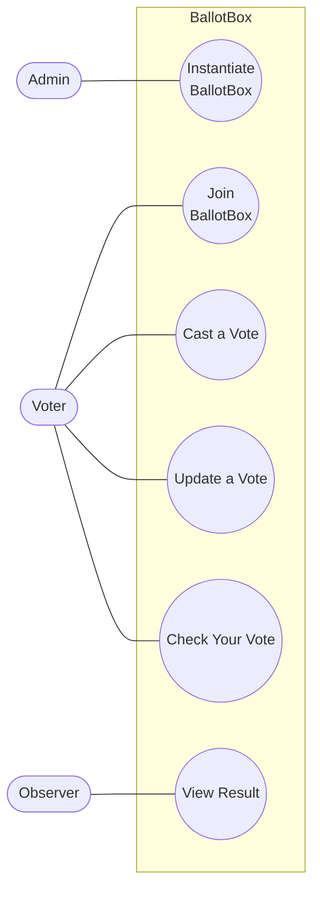
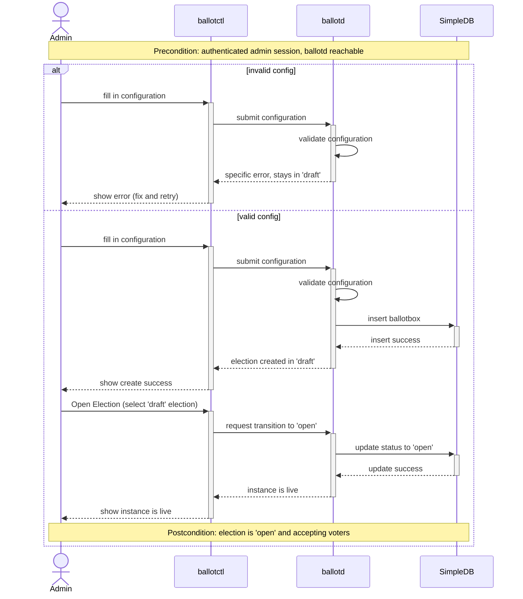
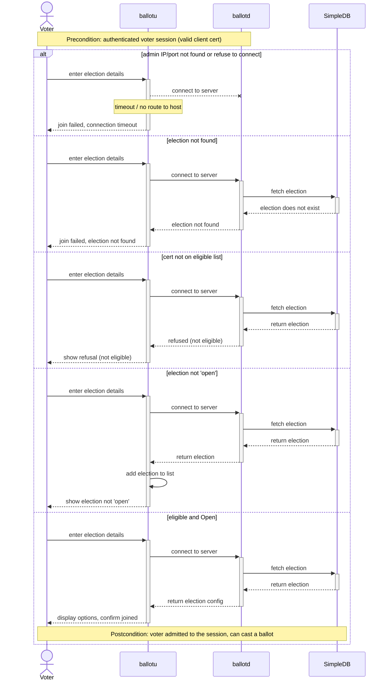
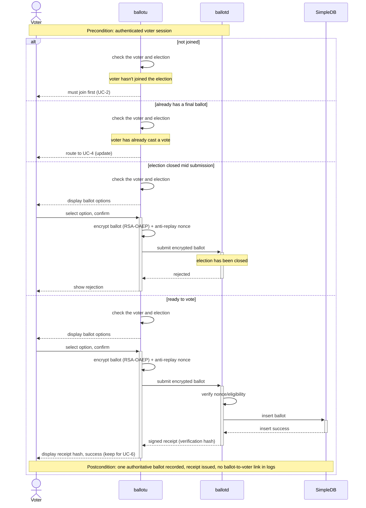
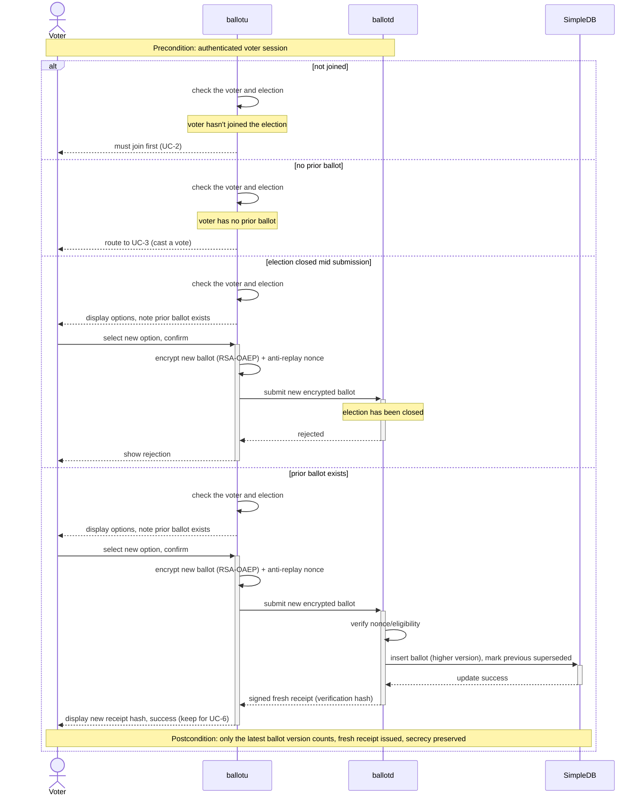
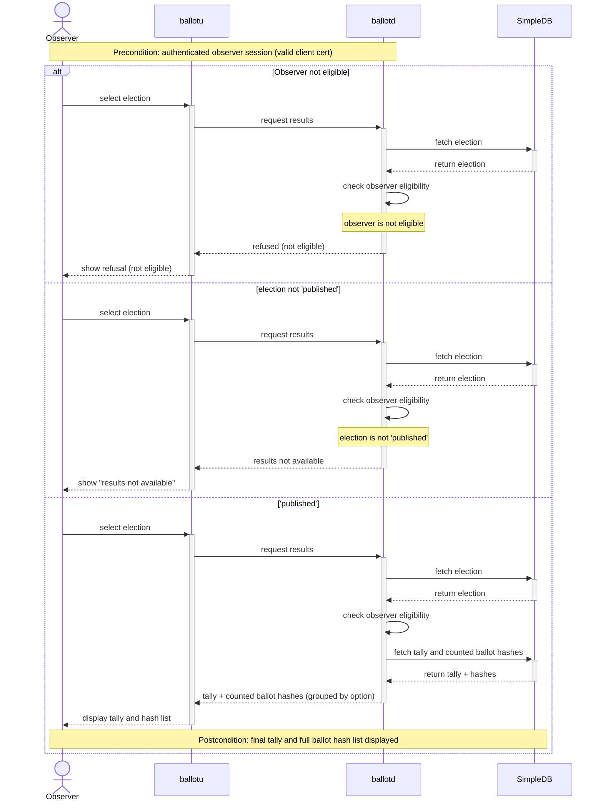
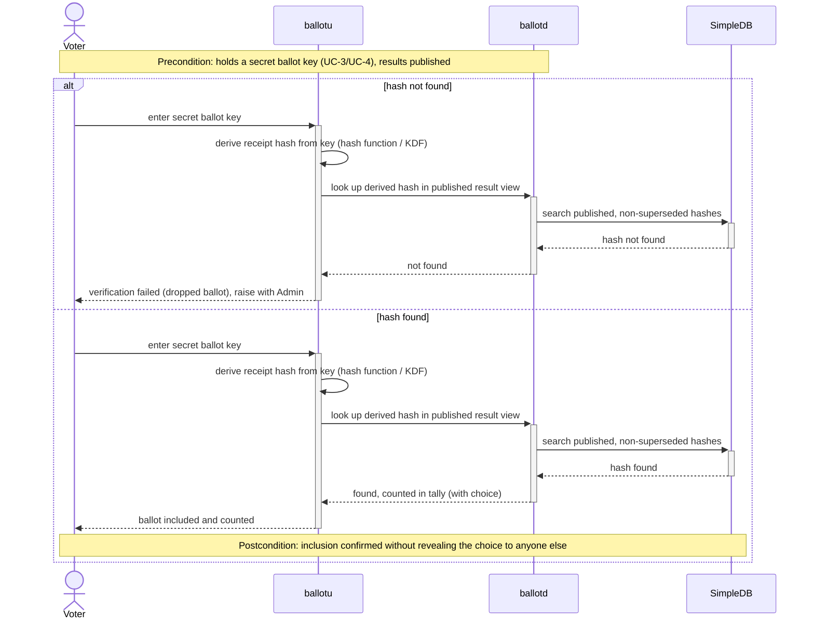
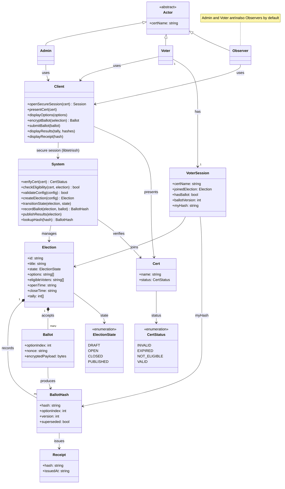

# BallotBox

BallotBox is a secure e-voting system for small orgs (clubs, coops, unions) solving the core tension: ballots must be secret (untraceable to voters) yet verifiable (tally is auditable). Built on the 50.005 CoreStack/tetriSH libraries, it delivers a CLI-based voter client and admin control tool (ballotctl) over a custom C backend (ballotd), communicating via SSH/shell sessions. Key guarantees: encrypted traffic, no double-votes, no ballot-to-voter linkage in logs, and concurrency-safe tallying.

---

1009098 Pitchayut Ariyachansil (Jedi)
1009164 Phatsakorn Ukanchanakitti (Pop)
1009195 Popsuk Sumetchoengprachya (Kenji)

---

- Admin: a person who runs and manages e-voting.
- Voter: a person who casts a vote.
- Observer: a person who is eligible to observe the voting results, under usual circumstances, a voter and an admin are also an observer.
- System: a backend service that runs and manages ballotbox programmes.
- Client: a frontend service or a GUI that voter or admin interact.
- ballotctl: an admin side client system program, a part of BallotBox.
- ballotu: a voter side client system program, a part of BallotBox.
- ballotd: a system, runs on admin machine, a part of BallotBox.
- SimpleDB: a DBMS, a project lab from 50.043 Database Systems, a part of BallotBox.

---

## Use Case Diagram

## Use Cases

### UC-1: Instantiate BallotBox

| Field          | Detail                                                             |
| -------------- | ------------------------------------------------------------------ |
| Description    | Admin creates a new election instance and opens it for voting.     |
| Actors         | Admin                                                              |
| Triggers       | Admin runs the create-election command in ballotctl.               |
| Preconditions  | Authenticated admin session (valid admin cert); ballotd reachable. |
| Postconditions | Election is Open and accepting voters.                             |

**Flow**

1. Admin fills in the title, options, eligible-voter certs, and open/close times in ballotctl.
2. ballotd validates the configuration (title and options required, close time after open time).
3. ballotd inserts the election into SimpleDB in 'draft'.
4. Admin runs Open Election in ballotctl and selects the 'draft' election.
5. ballotd updates the election status to 'open' in SimpleDB and begins accepting voters; ballotctl confirms the instance is live.

**Alternative Flows**

None.

**Error States**

2a. Invalid config (no title/options, or close time ≤ open time) → rejected with a specific error; stays in 'draft'.

### UC-2: Join BallotBox

| Field          | Detail                                                  |
| -------------- | ------------------------------------------------------- |
| Description    | An eligible voter joins an open election instance.      |
| Actors         | Voter                                                   |
| Triggers       | Voter runs the join command.                            |
| Preconditions  | Authenticated voter session (valid client cert).        |
| Postconditions | Voter is admitted to the session and can cast a ballot. |

**Flow**

1. Voter enters the election details (admin IP, port, and election ID) in ballotu.
2. ballotu connects to ballotd; ballotd fetches the election from SimpleDB.
3. ballotd checks the voter's cert against the eligible-voter list.
4. ballotd confirms the election is 'open' and admits the voter to the session.
5. ballotu displays the ballot options and confirms the voter has joined.

**Alternative Flows**

4a. Election not 'open' → cannot join yet; ballotu saves the election for later (UC-5, UC-6).

**Error States**

2a. ballotd unreachable (timeout / no route to host) → join failed.
2b. Election not found → join failed.
3a. Cert not on the eligible list → refused.

### UC-3: Cast a Vote

| Field          | Detail                                                                                        |
| -------------- | --------------------------------------------------------------------------------------------- |
| Description    | Voter submits a secret ballot and receives a verifiable receipt (hash).                       |
| Actors         | Voter                                                                                         |
| Triggers       | Voter runs the vote command before the close time.                                            |
| Preconditions  | Authenticated voter session.                                                                  |
| Postconditions | One authoritative ballot recorded; receipt hash issued; no log links the ballot to the voter. |

**Flow**

1. ballotu checks the voter has joined an 'open' election.
2. ballotu displays the ballot options; Voter selects one and confirms.
3. ballotu encrypts the ballot (RSA-OAEP) with a fresh anti-replay nonce and submits it to ballotd.
4. ballotd verifies the nonce and eligibility and inserts the ballot into SimpleDB.
5. ballotd issues a signed receipt hash; ballotu displays it for the voter to keep (UC-6).

**Alternative Flows**

1b. Voter already has a final ballot → route to UC-4 (Update a Vote).

**Error States**

1a. Voter has not joined the election → must join first (UC-2).
4a. Election closed mid-submission → ballotd rejects it; ballotu shows the rejection.

### UC-4: Update a Vote

| Field          | Detail                                                                                        |
| -------------- | --------------------------------------------------------------------------------------------- |
| Description    | Voter re-casts to override a prior selection while voting is still open.                      |
| Actors         | Voter                                                                                         |
| Triggers       | Voter runs update vote before the close time.                                                 |
| Preconditions  | Authenticated voter session.                                                                  |
| Postconditions | Tally counts only the latest ballot version; a new receipt hash is issued; secrecy preserved. |

**Flow**

1. ballotu checks the voter has joined an 'open' election and has a prior ballot.
2. ballotu displays the options, noting a prior ballot exists; Voter selects a new option and confirms.
3. ballotu encrypts the new ballot (RSA-OAEP) with a fresh anti-replay nonce and submits it to ballotd.
4. ballotd inserts it into SimpleDB under a higher version and marks the previous receipt superseded (only the latest version counts).
5. ballotd issues a fresh receipt hash; ballotu displays the updated success message.

**Alternative Flows**

1b. Voter has no prior ballot → route to UC-3 (Cast a Vote).

**Error States**

1a. Voter has not joined the election → must join first (UC-2).
4a. Election closed mid-submission → ballotd rejects it; ballotu shows the rejection.

### Decision table: vote command (UC-3 / UC-4)

| ~                                        | 1   | 2   | 3   | 4   | 5   |
| ---------------------------------------- | --- | --- | --- | --- | --- |
| joined                                   | N   | Y   | Y   | Y   | Y   |
| has prior ballot                         | -   | N   | N   | Y   | Y   |
| election open                            | -   | N   | Y   | N   | Y   |
| **actions**                              |     |     |     |     |     |
| must join first                          | X   |     |     |     |     |
| rejected (closed)                        |     | X   |     | X   |     |
| cast (UC-3), receipt                     |     |     | X   |     |     |
| update (UC-4), supersede + fresh receipt |     |     |     |     | X   |

### UC-5: View Result

| Field          | Detail                                                                         |
| -------------- | ------------------------------------------------------------------------------ |
| Description    | Anyone views the published tally together with the list of ballot hashes.      |
| Actors         | Observer                                                                       |
| Triggers       | Observer runs the results command.                                             |
| Preconditions  | Authenticated observer session (valid client cert).                            |
| Postconditions | The final tally and the full list of ballot verification hashes are displayed. |

**Flow**

1. Observer selects an election to view in ballotu.
2. ballotd fetches the election from SimpleDB and checks the observer's eligibility to observe it.
3. ballotd confirms the election is 'published' and returns the tally and the counted ballot hashes from SimpleDB.
4. ballotu displays the tally and the hash list (grouped by option) so a voter can locate their own (UC-6).

**Alternative Flows**

None.

**Error States**

2a. Observer not eligible → refused.
3a. Election not 'published' → results not available.

### UC-6: Check Your Vote

| Field          | Detail                                                                                  |
| -------------- | --------------------------------------------------------------------------------------- |
| Description    | A voter confirms their own ballot was counted, using their secret ballot key.           |
| Actors         | Voter                                                                                   |
| Triggers       | Voter runs the check command.                                                           |
| Preconditions  | Voter holds a secret ballot key from UC-3/UC-4; results published.                      |
| Postconditions | Voter confirms inclusion of their ballot without revealing their choice to anyone else. |

**Flow**

1. Voter enters their secret ballot key in ballotu.
2. ballotu derives the receipt hash from the key (hash function / KDF).
3. ballotu sends the derived hash to ballotd to look up in the published result view.
4. ballotd searches the published, non-superseded hashes in SimpleDB and confirms the hash is counted in the tally.
5. ballotu reports the voter's ballot was included and shows their recorded choice.

**Alternative Flows**

None.

**Error States**

4a. Derived hash not found in the published results → verification failed; ballotu flags it as a dropped ballot for the voter to raise with the Admin.

---

## Class Diagram

