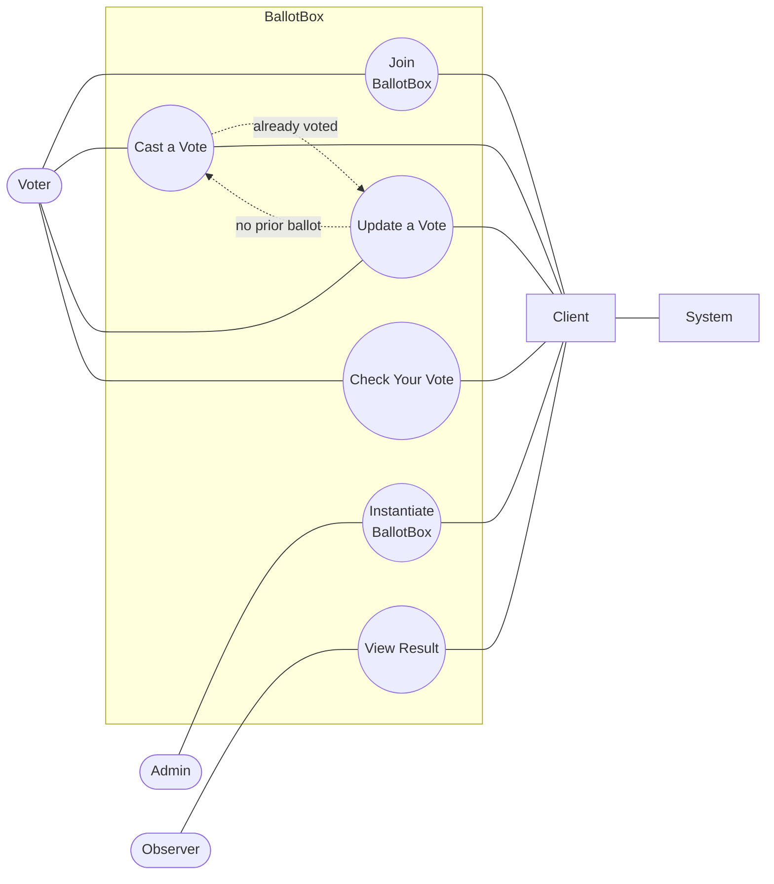
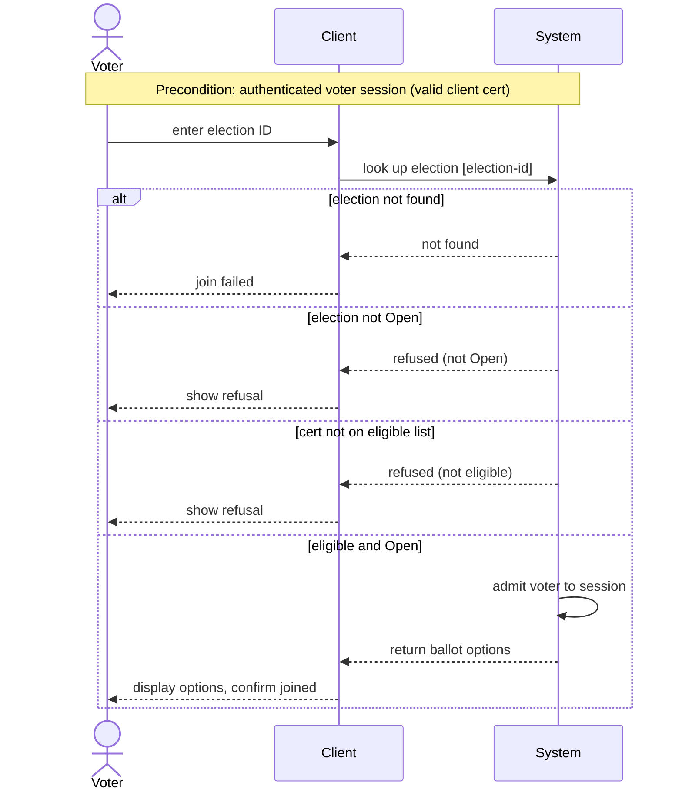
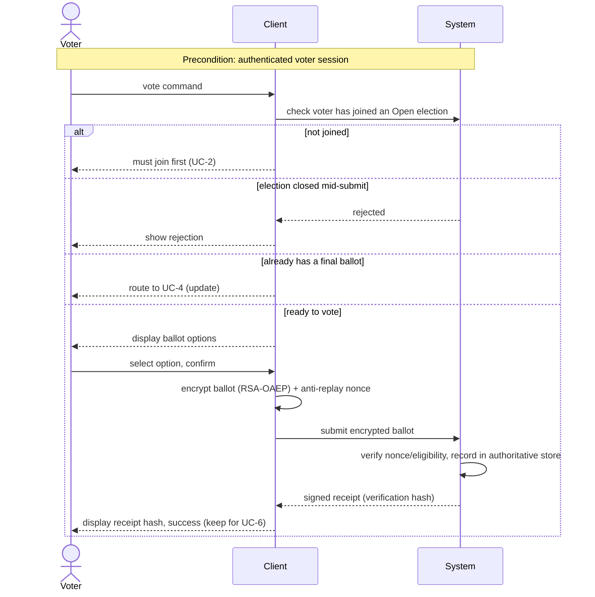
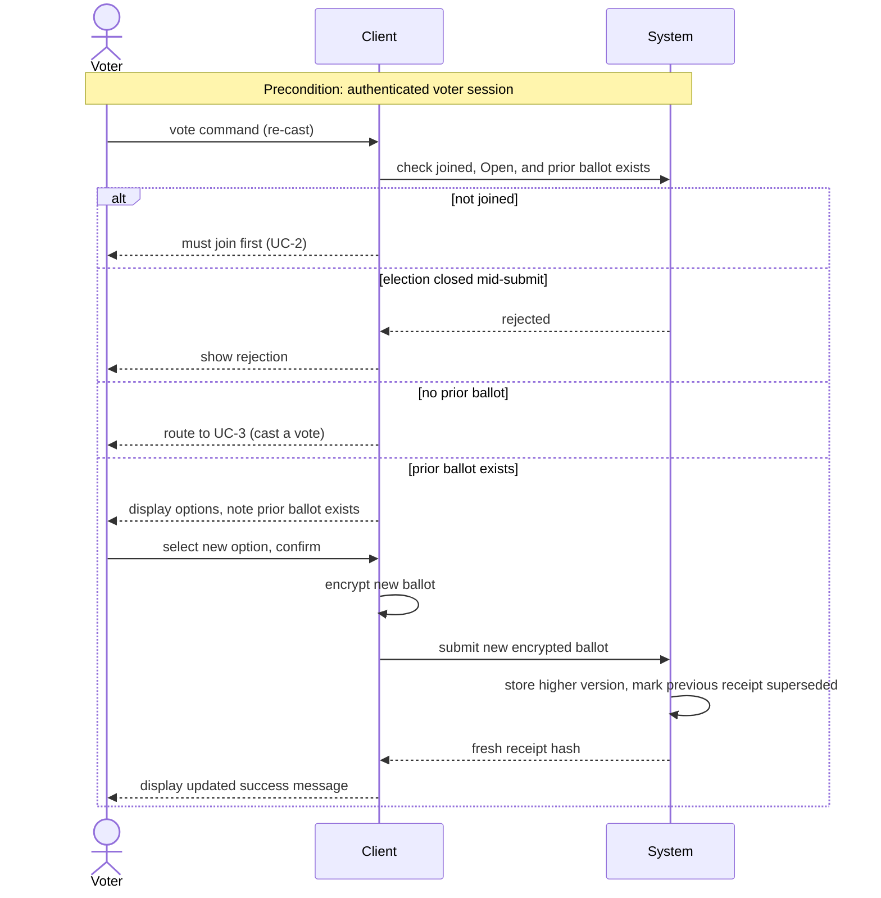
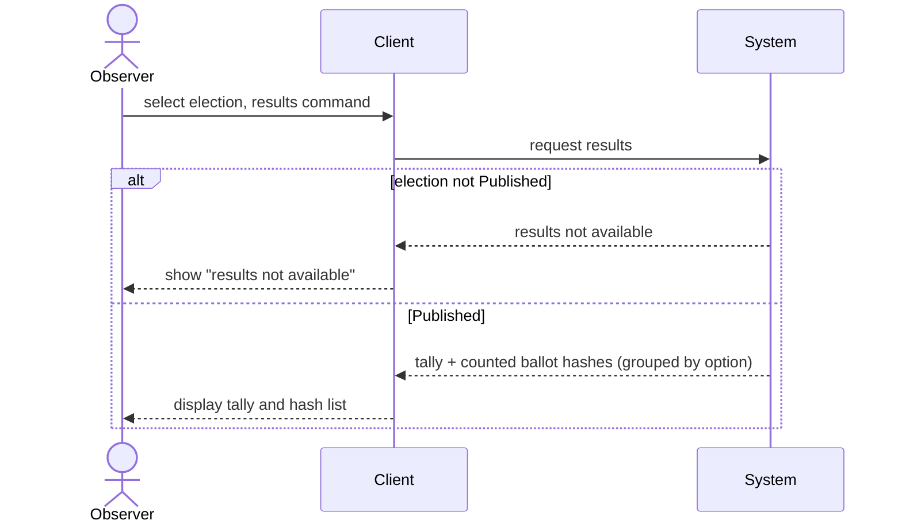
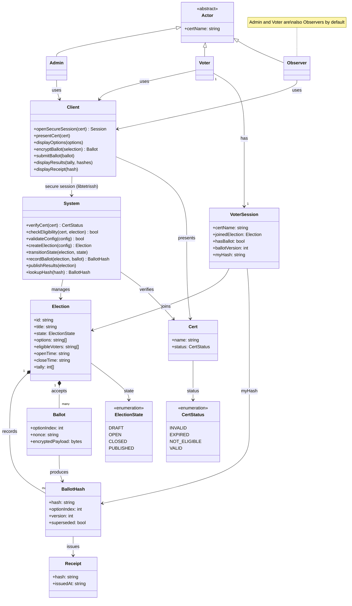

# BallotBox

BallotBox is a secure e-voting system for small orgs (clubs, coops, unions) solving the core tension: ballots must be secret (untraceable to voters) yet verifiable (tally is auditable). Built on the 50.005 CoreStack/tetriSH libraries, it delivers a CLI-based voter client and admin control tool (ballotctl) over a custom C backend (ballotd), communicating via SSH/shell sessions. Key guarantees: encrypted traffic, no double-votes, no ballot-to-voter linkage in logs, and concurrency-safe tallying.

---

1009098 Pitchayut Ariyachansil (Jedi)
1009164 Phatsakorn Ukanchanakitti (Pop)
1009195 Popsuk Sumetchoengprachya (Kenji)

---

- Admin: a person who runs and manages e-voting.
- Voter: a person who casts a vote.
- Observer: a person who is eligible to observe the voting results, under usual circumstances, a voter and an admin are also an observer.
- System: a backend service that runs and manages ballotbox programmes.
- Client: a frontend service or a GUI that voter or admin interact.

---

## Use Case Diagram



## Use Cases

### UC-1: Instantiate BallotBox

| Field          | Detail                                                                                                                  |
| -------------- | ----------------------------------------------------------------------------------------------------------------------- |
| Description    | Admin creates a new election instance and opens it for voting.                                                          |
| Actors         | Admin                                                                                                                   |
| Triggers       | Admin runs ballotctl create, then ballotctl open.                                                                       |
| Preconditions  | Authenticated admin session (valid admin cert); System reachable.                                                       |
| Postconditions | Election is Open and accepting voters.                                                                                  |
| Error States   | Invalid config (no title/options, or close time ≤ open time) → rejected; stays in Draft for the Admin to fix and retry. |

**Flow**

1. Admin opens the Create Election form and enters title, options, eligible-voter certs, and open/close times.
2. System validates the configuration (title and options required, close time after open time).
3. System initialises the authoritative store for the election in Draft.
4. Admin runs Open Election and selects the Draft election.
5. System transitions the election Draft → Open and begins accepting voters; Client confirms the instance is live.

```mermaid
sequenceDiagram
    actor Admin
    participant Client
    participant System

    note over Admin,System: Precondition: authenticated admin session; System reachable

    Admin->>Client: Create Election
    Client->>System: submit configuration
    System->>System: validate configuration
    alt invalid config
        System-->>Client: specific error, stays in Draft
        Client-->>Admin: show error (fix and retry)
    else valid config
        System->>System: initialise authoritative store (Draft)
        System-->>Client: election created in Draft
        Client-->>Admin: show create success
        Admin->>Client: Open Election (select Draft election)
        Client->>System: request transition to Open
        System->>System: transition Draft to Open, begin accepting voters
        System-->>Client: instance is live
        Client-->>Admin: confirm instance is live
    end
```

### UC-2: Join BallotBox

| Field          | Detail                                                                                                 |
| -------------- | ------------------------------------------------------------------------------------------------------ |
| Description    | An eligible voter joins an open election instance.                                                     |
| Actors         | Voter                                                                                                  |
| Triggers       | Voter runs the join command with the election ID.                                                      |
| Preconditions  | Authenticated voter session (valid client cert).                                                       |
| Postconditions | Voter is admitted to the session and can cast a ballot.                                                |
| Error States   | Election ID not found → join failed. Election not Open → refused. Cert not on eligible list → refused. |

**Flow**

1. Voter enters the election ID in the client.
2. System looks up the election and confirms it is Open.
3. System checks the voter's cert against the eligible-voter list.
4. System admits the voter to the session.
5. Client displays the ballot options and confirms the voter has joined.



### UC-3: Cast a Vote

| Field          | Detail                                                                                        |
| -------------- | --------------------------------------------------------------------------------------------- |
| Description    | Voter submits a secret ballot and receives a verifiable receipt (hash).                       |
| Actors         | Voter                                                                                         |
| Triggers       | Voter runs the vote command after joining.                                                    |
| Preconditions  | Authenticated voter session.                                                                  |
| Postconditions | One authoritative ballot recorded; receipt hash issued; no log links the ballot to the voter. |
| Error States   | Not joined → must join first. Election closed mid-submit → rejected.                          |

**Flow**

1. System checks the voter has joined an Open election.
2. Client displays the ballot options; Voter selects one and confirms.
3. Client encrypts the ballot (RSA-OAEP) with a fresh anti-replay nonce and submits it.
4. System verifies the nonce and eligibility and records the ballot in the authoritative store.
5. System issues a receipt hash; Client displays it for the voter to keep (UC-6).

**Alternative Flow**

- 1a. Voter already has a final ballot → route to UC-4 (Update a Vote).



### UC-4: Update a Vote

| Field          | Detail                                                                                        |
| -------------- | --------------------------------------------------------------------------------------------- |
| Description    | Voter re-casts to override a prior selection while voting is still open.                      |
| Actors         | Voter                                                                                         |
| Triggers       | Voter runs vote again before the close time.                                                  |
| Preconditions  | Authenticated voter session.                                                                  |
| Postconditions | Tally counts only the latest ballot version; a new receipt hash is issued; secrecy preserved. |
| Error States   | Not joined → must join first. Election closed mid-submit → rejected.                          |

**Flow**

1. System checks the voter has joined an Open election and has a prior ballot.
2. Client displays the options, noting a prior ballot exists; Voter selects a new option and confirms.
3. Client encrypts the new ballot and submits it.
4. System stores it under a higher version and marks the previous receipt superseded (only the latest version counts).
5. System issues a fresh receipt hash; Client displays the updated success message.

**Alternative Flow**

- 1a. Voter has no prior ballot → route to UC-3 (Cast a Vote).



### UC-5: View Result

| Field          | Detail                                                                         |
| -------------- | ------------------------------------------------------------------------------ |
| Description    | Anyone views the published tally together with the list of ballot hashes.      |
| Actors         | Observer                                                                       |
| Triggers       | Observer runs the results command.                                             |
| Preconditions  | -                                                                              |
| Postconditions | The final tally and the full list of ballot verification hashes are displayed. |
| Error States   | Election not Published → "results not available".                              |

**Flow**

1. Observer selects an election to view.
2. System confirms the election is Published and returns the tally and the list of counted ballot hashes.
3. Client displays the tally and the hash list (grouped by option) so a voter can locate their own (UC-6).



### UC-6: Check Your Vote

| Field          | Detail                                                                                  |
| -------------- | --------------------------------------------------------------------------------------- |
| Description    | A voter confirms their own ballot was counted, using their secret ballot key.           |
| Actors         | Voter                                                                                   |
| Triggers       | Voter runs the check command with their secret ballot key.                              |
| Preconditions  | Voter holds a secret ballot key from UC-3/UC-4; results published.                      |
| Postconditions | Voter confirms inclusion of their ballot without revealing their choice to anyone else. |
| Error States   | -                                                                                       |

**Flow**

1. Voter enters their secret ballot key.
2. Client derives the receipt hash from the key (hash function / KDF).
3. Client looks the derived hash up against the published result view.
4. System confirms the hash is present and counted in the tally.
5. Client reports the voter's ballot was included and shows their recorded choice.

**Alternative Flow**

- 4a. Hash not found in the published tally → verification failed; Client flags it as a dropped ballot for the voter to raise with the Admin.

```mermaid
sequenceDiagram
    actor Voter
    participant Client
    participant System

    note over Voter,System: Precondition: holds a secret ballot key (UC-3/UC-4); results published

    Voter->>Client: enter secret ballot key
    Client->>Client: derive receipt hash from key (hash function / KDF)
    Client->>System: look up derived hash in published result view
    System->>System: search published, non-superseded hashes
    alt hash found
        System-->>Client: found, counted in tally (with choice)
        Client-->>Voter: ballot included and counted
    else hash not found
        System-->>Client: not found
        Client-->>Voter: verification failed (dropped ballot), raise with Admin
    end
```

---

## Class Diagram


