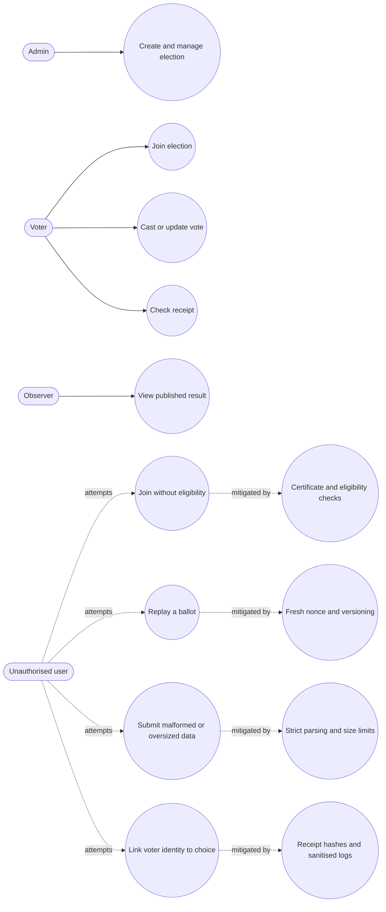

# BallotBox Final Report

1009098 Pitchayut Ariyachansil
1009164 Phatsakorn Ukanchanakitti
1009195 Popsuk Sumetchoengprachya

BallotBox is a secure e-voting system for small orgs (clubs, coops, unions) solving the core tension: ballots must be secret (untraceable to voters) yet verifiable (tally is auditable). Built on the 50.005 CoreStack/tetriSH libraries, it delivers a CLI-based voter client and admin control tool (ballotctl) over a custom C backend (ballotd), communicating via SSH/shell sessions.

Shared library with tetriSH
| tetrish | a shell|
| tetrislogd | a logger daemon |
| libhtttp | a http protocol |
| libtetrissh | a secure shell |
| libtetrisui | a ui library |
| libtetrisauth | an authentication library |
| libtetrisdb and tetrisdb | a connector to SimpleDB |
| libtetrisutil | a utility library |

## 1. Requirements

BallotBox is a secure electronic voting system for small organisations such as clubs, cooperatives, and unions.
It supports six use cases: create an election, join an election, cast a vote, update a vote, publish results, and verify a receipt.
The system must authenticate participants, prevent replay and double counting, preserve ballot secrecy, store election data durably, and let voters verify that the final tally includes their latest ballot.
The complete use-case specifications, alternative flows, error states, and sequence diagrams appear in [README.md](README.md#use-cases).

## 2. Design

BallotBox uses a layered C architecture.
`ballotu` and `ballotctl` provide voter and administrator terminal interfaces through `libtetrisui`.
`libballotclient` validates client actions, encodes messages, encrypts ballots, and communicates through `libtetrissh` and `libhtttp`.
`ballotd` dispatches authenticated requests to `libballotbrain`, which owns election validation, lifecycle rules, eligibility, ballot versioning, receipt generation, and result publication.
`libtetrisdb` serialises database access to SimpleDB, while `tetrislogd` records operational events without voter-choice links.

The domain and solution class diagrams define structures, operations, associations, and multiplicities for the voter client, administrator client, and daemon tiers.
They appear in [README.md](README.md#class-diagram) and correspond to the six use-case sequence diagrams in the same document.
The module boundaries, dependency rules, concurrency model, and design trade-offs appear in [DESIGN.md](DESIGN.md).

## 3. Implementation Challenges

### 3.1 Algorithmic challenges

The main algorithmic problem was reconciling secrecy with verifiability.
BallotBox encrypts each ballot, stores a receipt hash rather than exposing the vote-owner relationship, and publishes only live ballot hashes with the tally.
A voter can therefore confirm inclusion using a private receipt without revealing their identity or choice.
Ballot versioning marks earlier votes as superseded so repeated updates produce exactly one counted ballot.

### 3.2 Engineering challenges

The system integrates ncurses interfaces, a custom secure transport, OpenSSL cryptography, C daemons, and a Java SimpleDB process.
The database wire protocol has no request identifiers, so `libtetrisdb` funnels writes through a bounded queue and one worker thread to prevent interleaved requests.
Explicit interfaces isolate storage, transport, and cryptography, allowing core election logic to run against test substitutes while real-process tests verify the adapters.
Authentication, strict frame decoding, bounded inputs, graceful shutdown, and non-blocking logging reduce failure propagation across process boundaries.

### 3.3 Testing challenges

Real authentication, database, socket, process, and concurrency tests require more setup than pure unit tests.
The suite therefore separates substituted unit tests from real-process infrastructure, integration, and end-to-end tests.
Environment-tolerant cases skip visibly when Java or `db/dist/simpledb.jar` is unavailable.
The strict system executable treats either missing dependency as a failure.
The stale `-lcommon` test links were replaced with the current `-ltetrisutil` library name.

## 4. Testing

The detailed plan, decision table, and use-case traceability matrix appear in [TEST.md](TEST.md).
The executable case-by-case inventory appears in [tests/TESTS.md](tests/TESTS.md).

### 4.1 Unit testing

The Unity-based unit suite covers both backend and frontend logic.
Backend cases test configuration boundaries, legal and illegal lifecycle transitions, eligibility partitions, replay rejection, malformed ballots, closed-election submission, concurrency, superseding, tallying, and secrecy-safe logging.
Frontend cases test administrator request construction, voter join outcomes, cast-versus-update routing, receipt handling, codec round trips, missing fields, unknown methods, and malformed ciphertext.
Tests use fake storage, crypto, and transport seams so failures remain local and deterministic.

### 4.2 Integration testing

Integration tests exercise real `ballotd`, `libballotclient`, secure sessions, admin and voter channels, and SimpleDB.
They cover invalid and successful creation, channel separation, malformed and oversized frames, concurrent administrator requests, create-to-join flow, reconnect-after-cast behavior, and published result transport.
Infrastructure tests separately verify database persistence and transactions, JWT authentication, configuration parsing, logging delivery, and daemon lifecycle.

### 4.3 System end-to-end testing

The strict `bin/test_system_e2e` executable starts the real services and drives the same public client-library calls used by `ballotu` and `ballotctl`.
Its eight named groups cover every documented UC-1 through UC-8 main, alternative, error, and lifecycle path, plus a complete create-to-check journey.
The journey performs create, open, eligible join, cast, disconnect, rejoin, update, close, publish, exact-tally inspection, old-receipt rejection, and latest-receipt verification.
The suite also checks closed-mid-cast and closed-mid-update behavior, persistent prior-ballot recovery, the complete transition matrix, and the absence of voter-to-choice links in real daemon logs.
`make final-test` performs a clean environment-tolerant verification suite and then the strict system suite with no permitted dependency skips.

The final recorded run completed on 11 August 2026 on arm64 macOS 26.2 with Apple Clang 17.0.0 and OpenJDK 17.0.20.
The command was `make final-test` and completed in 12.06 seconds with zero failures and zero system-test skips.
All eight system traceability groups passed.
Implementation found and corrected stale shared-library links, a strict-target skip loophole, ignored `tetrislogd` command-line overrides, and a malformed-log fixture that did not initialise the newly added dropped-record field.

### 4.4 Robustness testing

Negative tests cover expired or ineligible certificates, invalid election states, duplicate registration, replayed nonces, invalid option boundaries, malformed SQL and wire frames, oversized input, log injection, database timeouts, peer disconnects, stale lock files, missing secrets, weak permissions, and process termination during active sessions.
Concurrency tests submit 16 ballots simultaneously and perform multi-process registration against a growing table.
Load tests send 20,000 log records while the logging daemon is paused and verify that producers never block.

## 5. Feature Progress and Workload Distribution

| Period      | Jedi - application and platform                                            | Kenji - daemon and integration                                             | Pop - connectivity and security                              |
| ----------- | -------------------------------------------------------------------------- | -------------------------------------------------------------------------- | ------------------------------------------------------------ |
| Meeting 1   | Planned command and application logic                                      | Planned shell daemon and queue                                             | Planned networking and secure sessions                       |
| Meeting 2   | Completed terminal clients, shell, and mock-data UI                        | Implemented `ballotd` foundation                                           | Completed the base HTTTP and tetriSH transport work          |
| Meeting 3   | Completed client and election logic with unit tests                        | Continued daemon integration                                               | Completed the secure connectivity layer                      |
| Final phase | Added authentication, database, UI refactors, CI, and infrastructure tests | Connected database, clients, and daemon; added integration tests and fixes | Renewed certificates and completed the shared-library rename |

The team rescheduled integration and end-to-end work after Meeting 2 because the clients were ready before the database, cryptography, and daemon seams.
Meeting 3 therefore concentrated on independently testable logic, while the final phase joined the layers and expanded real-process testing.
Git history currently records 38 commits under Jedi's identities, 11 under Kenji's identities, and 6 under Pop's identities; commit count is supporting evidence and does not measure task complexity.
The dated records are available in [PM1.md](PM1.md), [PM2.md](PM2.md), and [PM3.md](PM3.md).

## 6. Industry Intellectual Property

The team confirms that this is an academic project with no industry partner, partner code, proprietary data sample, or partner intellectual property.
Written industry-mentor approval is therefore not applicable.

## 7. Sustainability, Diversity, and Inclusion

BallotBox contributes most directly to UN SDG 16, particularly Target 16.6 on accountable institutions and Target 16.7 on inclusive, participatory decision-making.
Receipt-based verification lets each voter confirm that the published result includes their latest ballot, while authenticated election management, replay protection, and durable records strengthen accountability.
Secret ballots and logs without voter-choice links protect participation from disclosure, while eligibility rules let small organisations define their electorate consistently.

The project also contributes to UN SDG 12 on responsible consumption by reducing paper ballots, printing, physical storage, and travel for small elections.
Its terminal-based C services can run on existing modest hardware instead of requiring specialised voting machines.
These benefits depend on proportionate deployment: organisers should retain election data only as long as required, reuse existing equipment, and account for the electricity and network resources consumed by digital voting.
