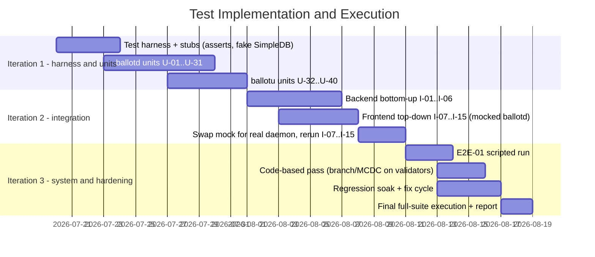

# BallotBox Test Plan

This document defines the test plan for BallotBox.
Test cases are specified in table (document) format, not code.
Use cases (UC-1 to UC-6), components, and classes referenced here are defined in [README](README.md).

Levels of testing follow the design abstraction levels:
unit tests target the detailed design (functions in the class diagram),
integration tests target the preliminary design (component boundaries),
and the end-to-end test targets the requirement specification (use cases).

Components under test:

- `ballotd`: backend daemon (election lifecycle, eligibility, ballot recording, tally, publishing).
- `ballotu`: voter client (join, cast, update, check).
- `ballotctl`: admin client (create, open, close, publish).
- `SimpleDB`: authoritative store.
- `libtetrissh`: secure session layer between clients and `ballotd`.

---

## 1. Unit Test Cases

Unit tests are specification-based (black box): each unit is treated as a function from inputs to outputs defined by the use cases, with all collaborators stubbed.
Test cases are derived with the technique that fits the input structure:

- Boundary value testing (robust) for numerical, independent inputs: config time window, option count, option index.
- Equivalence class testing where the input domain partitions cleanly: the join outcome partitions of UC-2 (not found / not open / not eligible / invalid cert / admitted), the illegal state-transition pairs, and the hash lookup partitions of UC-6 (counted / superseded / unknown).
- Decision table testing for the vote command of UC-3/UC-4, because its inputs are dependent (joined, prior ballot, election state).

### Decision table: vote command (UC-3 / UC-4)

Conditions are dependent, so we enumerate rules rather than boundaries.

| ~                                        | 1   | 2   | 3   | 4   | 5   |
| ---------------------------------------- | --- | --- | --- | --- | --- |
| joined                                   | N   | Y   | Y   | Y   | Y   |
| has prior ballot                         | -   | N   | N   | Y   | Y   |
| election open                            | -   | N   | Y   | N   | Y   |
| **actions**                              |     |     |     |     |     |
| must join first                          | X   |     |     |     |     |
| rejected (closed)                        |     | X   |     | X   |     |
| cast (UC-3), receipt                     |     |     | X   |     |     |
| update (UC-4), supersede + fresh receipt |     |     |     |     | X   |

Rules 1, 3, 5 are testable in the client unit (U-37 to U-39); rules 2 and 4 need the daemon and are covered by U-19 at the daemon unit level and I-12 at the integration level.

### ballotd unit tests

Precondition for all rows unless stated otherwise: daemon initialised with a fake in-memory store; authenticated session assumed via stubbed cert layer.
Row-specific preconditions are given in Input / Setup.

| ID   | UC     | Technique | Purpose                                | Input / Setup                                                    | Expected Output                                          | Postcondition                                    |
| ---- | ------ | --------- | -------------------------------------- | ---------------------------------------------------------------- | -------------------------------------------------------- | ------------------------------------------------ |
| U-01 | UC-1   | BVT       | Valid config accepted                  | Title, 2 options (min valid), close = open + 1h                  | `validateConfig` true                                    | Election exists in `DRAFT`                       |
| U-02 | UC-1   | BVT       | Option count below boundary            | Config with 1 option, then 0 options                             | Rejected with specific error                             | No election created                              |
| U-03 | UC-1   | BVT       | Empty title rejected                   | Config with empty title                                          | Rejected with specific error                             | No election created                              |
| U-04 | UC-1   | BVT       | Time window boundary                   | close = open, then close = open - 1s                             | Rejected with specific error                             | No election created                              |
| U-05 | UC-1   | BVT       | Minimum valid time window              | close = open + 1s                                                | Accepted                                                 | Election exists in `DRAFT`                       |
| U-06 | UC-1   | -         | Legal transition chain                 | `DRAFT` election; transition OPEN, then CLOSED, then PUBLISHED   | Each transition succeeds                                 | Final state `PUBLISHED`                          |
| U-07 | -      | ECT       | Illegal transitions rejected           | One representative per illegal pair: PUBLISHED→OPEN, DRAFT→CLOSED, OPEN→DRAFT, CLOSED→OPEN | Each rejected                  | State unchanged in every case                    |
| U-08 | UC-5   | -         | Publish requires CLOSED                | `OPEN` election, `publishResults` called                         | Rejected                                                 | State stays `OPEN`, no result view created       |
| U-09 | UC-2   | ECT       | Join: election not found               | Join request with unknown election ID                            | "election not found" error                               | No session created                               |
| U-10 | UC-2   | ECT       | Join: election not open                | Join request for election in `DRAFT`, `CLOSED`, `PUBLISHED` (one case each) | Refused, "not open" with current state        | No session created                               |
| U-11 | UC-2   | ECT       | Join: unlisted cert refused            | Valid cert not on eligible list, election `OPEN`                 | Refused, reason "not eligible"                           | No session created                               |
| U-12 | UC-2   | ECT       | Join: invalid or expired cert refused  | Cert with `EXPIRED` status, then `INVALID`                       | `verifyCert` returns the status, session refused         | No session created                               |
| U-13 | UC-2   | ECT       | Join: eligible voter admitted          | Cert on eligible list, election `OPEN`                           | `checkEligibility` true, election config returned        | Voter admitted, can cast                         |
| U-14 | UC-3   | -         | Fresh nonce accepted                   | Ballot with unused nonce from admitted voter                     | Ballot accepted                                          | Nonce marked used                                |
| U-15 | UC-3   | -         | Replayed nonce rejected                | Same encrypted ballot submitted twice                            | Second submission rejected                               | Exactly one ballot recorded                      |
| U-16 | UC-3   | BVT       | Option index boundaries                | n options; index -1, 0, n-1, n                                   | -1 and n rejected; 0 and n-1 accepted                    | Only valid ballots recorded                      |
| U-17 | UC-3   | -         | Malformed ballot rejected              | Payload that fails RSA-OAEP decryption (garbage bytes)           | Rejected with decryption error                           | Store unchanged, nonce not consumed              |
| U-18 | UC-3   | -         | Ineligible ballot rejected at record   | Well-formed ballot whose cert is not on the eligible list        | Rejected (eligibility re-checked at record time)         | Store unchanged                                  |
| U-19 | UC-3/4 | DT rules 2, 4 | Submit after close rejected        | Ballot arrives when state is `CLOSED`; once with no prior ballot, once with prior ballot | Rejected in both cases           | Store unchanged, prior ballot still counted      |
| U-20 | UC-3   | -         | No double vote                         | Two distinct first-time ballots from the same cert               | Second stored as version 2                               | Tally counts exactly one ballot for that cert    |
| U-21 | UC-3   | -         | No ballot-to-voter link in logs        | Record a ballot, inspect log output                              | No (cert, ballot/hash) pairing in any log line           | Secrecy preserved                                |
| U-22 | UC-3   | -         | Concurrency-safe recording             | N threads submit ballots for distinct voters simultaneously      | All N accepted                                           | Exactly N ballots, tally = N, no corruption      |
| U-23 | UC-4   | -         | Supersede on update                    | Voter with ballot v1 submits v2                                  | Fresh receipt hash issued                                | v1 `superseded`, only v2 counted                 |
| U-24 | UC-4   | -         | Repeated updates, latest counts        | Voter submits v1, v2, v3                                         | Fresh receipt each time                                  | v1 and v2 `superseded`, tally counts only v3     |
| U-25 | UC-5   | -         | Tally counts latest only               | 3 voters, one updated once, then close + publish                 | Tally = 3 ballots                                        | Superseded version excluded from result view     |
| U-26 | UC-5   | -         | Results gated before publish           | Results request while election is `OPEN`, then `CLOSED`          | "results not available" in both cases                    | No tally or hash data returned                   |
| U-27 | UC-5   | -         | Ineligible observer refused            | Results request from cert outside the observer set               | Refused, reason "not eligible"                           | No tally or hash data returned                   |
| U-28 | UC-5   | BVT       | Zero-ballot publish                    | Election with 0 ballots, close + publish                         | Publish succeeds                                         | All-zero tally, empty hash list displayed safely |
| U-29 | UC-6   | ECT       | Lookup: counted hash found             | Hash of a live (non-superseded) published ballot                 | Found, counted, choice returned                          | -                                                |
| U-30 | UC-6   | ECT       | Lookup: superseded hash excluded       | Hash of a superseded ballot version                              | Not found                                                | Dropped-ballot path triggered client side        |
| U-31 | UC-6   | ECT       | Lookup: unknown hash not found         | Random hash never issued                                         | Not found                                                | No information leaked about other ballots        |

### ballotu unit tests

Precondition for all rows unless stated otherwise: client running against a stubbed daemon (`mock.c`); voter cert loaded.
Row-specific preconditions are given in Input / Setup.

| ID   | UC   | Technique | Purpose                            | Input / Setup                                                | Expected Output                                          | Postcondition                                 |
| ---- | ---- | --------- | ---------------------------------- | ------------------------------------------------------------ | -------------------------------------------------------- | --------------------------------------------- |
| U-32 | UC-3 | -         | RSA-OAEP round trip                | Known selection and election public key                      | Ciphertext decrypts to the selection                     | Plaintext never leaves client buffer          |
| U-33 | UC-6 | -         | Deterministic receipt KDF          | Same secret ballot key twice                                 | Same receipt hash both times                             | -                                             |
| U-34 | UC-6 | -         | Distinct keys, distinct hashes     | Two different secret keys                                    | Different hashes, no collision on test corpus            | -                                             |
| U-35 | UC-2 | ECT       | Join: connection timeout handled   | Stub simulates unreachable host (timeout / no route)         | "join failed, connection timeout" shown                  | No session state created, client still usable |
| U-36 | UC-2 | ECT       | Join: not-open election handled    | Stub returns election with non-open state                    | "not open" shown                                         | Election added to local list (per UC-2 flow)  |
| U-37 | UC-3 | DT rule 1 | Vote before join blocked           | `vote` with no joined election in `VoterSession`             | "must join first" shown                                  | Nothing sent to server                        |
| U-38 | UC-3 | DT rule 3 | Cast flow selected                 | Joined, `hasBallot` false                                    | Cast flow (UC-3), receipt displayed                      | `hasBallot` true, `myHash` stored             |
| U-39 | UC-4 | DT rule 5 | Update flow selected               | Joined, `hasBallot` true                                     | Update flow (UC-4), fresh receipt displayed              | `ballotVersion` incremented                   |
| U-40 | UC-6 | -         | Dropped ballot flagged             | Valid key; stub returns "not found" for the derived hash     | "verification failed (dropped ballot), raise with Admin" | Voter directed to the admin escalation path   |

### Traceability: use case error states and alternative flows

Every error state and alternative flow declared in the README is claimed by at least one test case.

| UC   | Error state / alternative flow (from README)            | Covered by                       |
| ---- | ------------------------------------------------------- | -------------------------------- |
| UC-1 | Invalid config: no title / no options / bad time window | U-02, U-03, U-04, I-08           |
| UC-2 | Admin IP/port unreachable (timeout)                     | U-35, I-10                       |
| UC-2 | Election ID not found                                   | U-09, I-10                       |
| UC-2 | Cert not on eligible list                               | U-11, U-18, I-10                 |
| UC-2 | Election not `OPEN` (added to list, shown not open)     | U-10, U-36, I-10                 |
| UC-3 | Not joined → must join first                            | U-37                             |
| UC-3 | Alt 1a: already has final ballot → route to UC-4        | U-39                             |
| UC-3 | Election closed mid-submit → rejected                   | U-19, I-12                       |
| UC-4 | Not joined → must join first                            | U-37                             |
| UC-4 | Alt 1a: no prior ballot → route to UC-3                 | U-38                             |
| UC-4 | Election closed mid-submit → rejected                   | U-19, I-12                       |
| UC-5 | Observer not eligible → refused                         | U-27                             |
| UC-5 | Election not `PUBLISHED` → results not available        | U-26, I-14                       |
| UC-6 | Alt 4a: hash not found → dropped ballot flagged         | U-30, U-31, U-40, I-15           |

---

## 2. Integration Test Cases

### Strategy: call graph-based, sandwich (bottom-up backend, top-down frontend)

We use call graph-based integration rather than decomposition-based integration.
The lexical module structure (`src/ballotu`, `src/ballotctl`, `src/ballotd`, `src/libballotbrain`) does not reflect execution: no client code calls SimpleDB directly, exactly as in the Echo example where `app` never calls `MessageModel` without going through the router.
The actual call graph is:

```
ballotu / ballotctl → libtetrissh → ballotd handlers → SimpleDB
```

Defects in this system live on those edges, so the call graph is the structure we integrate along, applying a sandwich of the two directions:

- Backend: **bottom-up**.
  SimpleDB is integrated with `ballotd`'s storage layer first, then the ballot/election handlers on top, then the `libtetrissh` protocol layer.
  The unit tests for the storage layer are reused as driver code, so no mocking is needed on this half.
  Bottom-up fits because the store is the authoritative component and every upper layer depends on its correctness.
- Frontend: **top-down**.
  `ballotu`/`ballotctl` screens are integrated against a mocked daemon first (the existing `mock.c` stubs), then the mock is replaced by the real daemon.
  When a test fails after a replacement, the fault is isolated to the newly unmocked component.
  Top-down fits because the TUI flow logic and the daemon stubs already exist in the codebase.
- The two halves meet at the `libtetrissh` session boundary, which is the target of the client-daemon tests below.

### Backend integration (ballotd + SimpleDB, bottom-up)

Precondition for all: clean SimpleDB instance seeded per case (setup), wiped after (teardown).

| ID   | Call-graph edge            | UC   | Purpose                           | Input / Setup                        | Expected Output             | Postcondition                                          |
| ---- | -------------------------- | ---- | --------------------------------- | ------------------------------------ | --------------------------- | ------------------------------------------------------ |
| I-01 | ballotd storage → SimpleDB | UC-1 | Election survives restart         | Create election, restart `ballotd`   | Election reloaded           | Config and state identical to before restart           |
| I-02 | ballotd handlers → storage | UC-1 | Draft to Open persisted           | Create then open an election         | Transition succeeds         | DB row shows `OPEN`, subsequent fetch returns `OPEN`   |
| I-03 | ballotd handlers → storage | UC-3 | Ballot and hash stored atomically | Record one ballot                    | Receipt matches stored hash | One ballot row, one hash row                           |
| I-04 | ballotd handlers → storage | UC-4 | Version chain in store            | Cast then update                     | Update succeeds             | v1 `superseded=true`, v2 counted, only v2 in tally     |
| I-05 | ballotd handlers → storage | UC-3 | Parallel inserts under load       | 50 concurrent casts across 50 voters | All accepted                | 50 ballots stored, no lost writes, no duplicate hashes |
| I-06 | ballotd handlers → storage | UC-5 | Published view is consistent      | Close then publish                   | Publish succeeds            | DB tally equals count of non-superseded ballots        |

### Frontend integration (clients + ballotd over libtetrissh, top-down)

Precondition for all: real daemon running with seeded elections; clients connect over a real `libtetrissh` session.

| ID   | Call-graph edge     | UC     | Purpose                     | Input / Setup                                           | Expected Output                                              | Postcondition                          |
| ---- | ------------------- | ------ | --------------------------- | ------------------------------------------------------- | ------------------------------------------------------------ | -------------------------------------- |
| I-07 | ballotctl → ballotd | UC-1   | Admin creates and opens     | Valid config via ballotctl                              | "instance is live" shown                                     | Daemon state `OPEN`                    |
| I-08 | ballotctl → ballotd | UC-1   | Invalid config surfaced     | Config with close time before open time                 | Specific error shown                                         | Election remains in `DRAFT` flow       |
| I-09 | ballotu → ballotd   | UC-2   | Eligible voter joins        | Correct IP/port/ID, eligible cert                       | Options displayed, joined confirmed                          | Voter admitted to session              |
| I-10 | ballotu → ballotd   | UC-2   | All four refusal partitions | Wrong host; unknown ID; ineligible cert; non-open state | Timeout / not found / not eligible / not open, each distinct | No session created in any branch       |
| I-11 | ballotu → ballotd   | UC-3   | Encrypted cast over session | Joined voter casts a vote                               | Receipt hash displayed                                       | Wire traffic is ciphertext only        |
| I-12 | ballotu → ballotd   | UC-3/4 | Close race (DT rules 2, 4)  | Voter submits as ballotctl closes the election          | Rejection shown to voter                                     | No partial ballot stored               |
| I-13 | ballotu → ballotd   | UC-5   | Published tally displayed   | Observer requests published election                    | Tally plus hash list grouped by option                       | -                                      |
| I-14 | ballotu → ballotd   | UC-5   | Results gated               | Observer requests `CLOSED` election                     | "results not available"                                      | No tally data leaves the daemon        |
| I-15 | ballotu → ballotd   | UC-6   | Hash lookup both branches   | Key of counted ballot; key of superseded ballot         | Found and counted; not found flagged as dropped              | Choice revealed only to the key holder |

---

## 3. End-to-End Test (System Test)

Derived from the use case documents, in the system test case format.

User story: "As a club member, I can vote in an officers election, change my mind before it closes, and later verify that my final vote was counted, without anyone linking my ballot to me."

| Field          | Detail                                                                                                     |
| -------------- | ---------------------------------------------------------------------------------------------------------- |
| Test case ID   | E2E-01                                                                                                     |
| Test case name | Full election lifecycle with vote update and verification                                                  |
| Objective      | Exercise UC-1 through UC-6 across real `ballotd`, `ballotctl`, and two `ballotu` instances with no mocking |
| Pre-conditions | All three programs built; admin cert and two voter certs issued; SimpleDB empty                            |

Event sequence:

| Step | Actor    | Input                                                                    | Expected Output                                                                   |
| ---- | -------- | ------------------------------------------------------------------------ | --------------------------------------------------------------------------------- |
| 1    | Admin    | Create "Officers 2026" with 3 options and 2 eligible certs, then open it | ballotctl reports instance live                                                   |
| 2    | Voter A  | Join, cast for option 1                                                  | Receipt hash `H1` displayed                                                       |
| 3    | Voter B  | Join, cast for option 2                                                  | Receipt hash `H2` displayed                                                       |
| 4    | Voter A  | Update vote to option 3                                                  | Fresh receipt `H1'` displayed                                                     |
| 5    | Admin    | Close, then publish                                                      | ballotctl reports published                                                       |
| 6    | Observer | View results                                                             | Tally is option 2: 1, option 3: 1; hash list contains `H1'` and `H2` but not `H1` |
| 7    | Voter A  | Check vote with secret key                                               | "Included and counted", choice shown only to Voter A                              |
| 8    | Auditor  | Grep all `ballotd` and `tetrislogd` logs                                 | No line pairs a cert name with a ballot or hash                                   |

Post-conditions: election `PUBLISHED`; two counted ballots; one superseded ballot; secrecy and verifiability both demonstrated in one run.
Pass criterion: every expected output holds in a single uninterrupted scripted run.

---

## 4. Timeline

Testing follows the iterative life cycle model: each iteration runs unit then integration tests for the components built in that iteration, closes with **regression testing** (re-run all suites passed in previous iterations) and **progression testing** (pre-run upcoming cases, which are expected to fail until their feature lands).



| Phase                | Window          | Deliverable                                           | Gate to next phase                                                     |
| -------------------- | --------------- | ----------------------------------------------------- | ---------------------------------------------------------------------- |
| Harness              | Jul 20 - Jul 23 | C assert harness, fake SimpleDB, cert fixtures        | Harness runs a trivial passing test in CI (`make test`)                |
| Unit                 | Jul 23 - Aug 1  | U-01..U-40 automated                                  | All unit tests green; security cases U-14..U-18, U-20, U-21 mandatory  |
| Backend integration  | Aug 1 - Aug 7   | I-01..I-06 against real SimpleDB, driven by unit code | Persistence and concurrency cases green                                |
| Frontend integration | Aug 3 - Aug 11  | I-07..I-15, first on mocked then real daemon          | All four UC-2 refusal partitions observable in the TUI                 |
| System (E2E)         | Aug 11 - Aug 14 | Scripted E2E-01                                       | Full event sequence passes on a clean machine                          |
| Hardening            | Aug 13 - Aug 19 | Coverage report, soak results, final test report      | Zero known correctness or secrecy defects                              |

The code-based pass in iteration 3 complements the specification-based suites: measure branch coverage on `ballotd` (gcov/lcov) and check MCDC on the compound predicates in config validation and eligibility, adding cases where a condition cannot yet independently affect the outcome.

Execution policy: unit and backend integration suites run on every commit (regression); frontend integration and E2E run nightly and before any demo.
